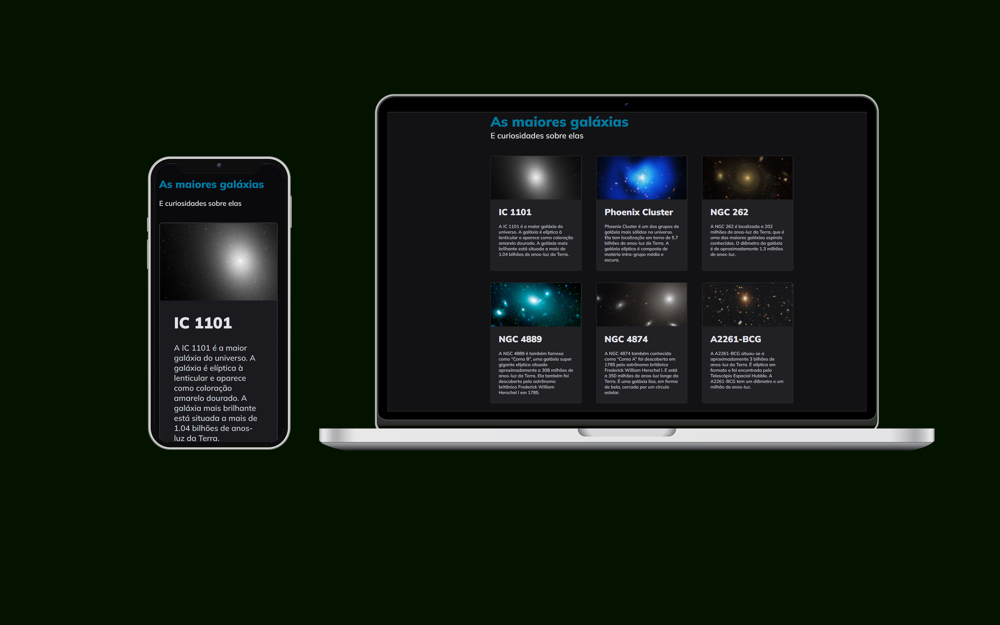

<h1 align="center">Galaxies</h1>

  

  

## 💻 Projeto

Este projeto foi idealizado com o objetivo de aprimorar minha expertise em HTML, CSS e principalmente em GRID, através do suporte e recursos fornecidos pela plataforma Rockeseat.

- [Acesse o projeto](https://galaxies-gamma.vercel.app/)

## 🚀 Tecnologias

Esse projeto foi desenvolvido com as seguintes tecnologias:

- HTML e CSS
- Git e Github
- Figma
